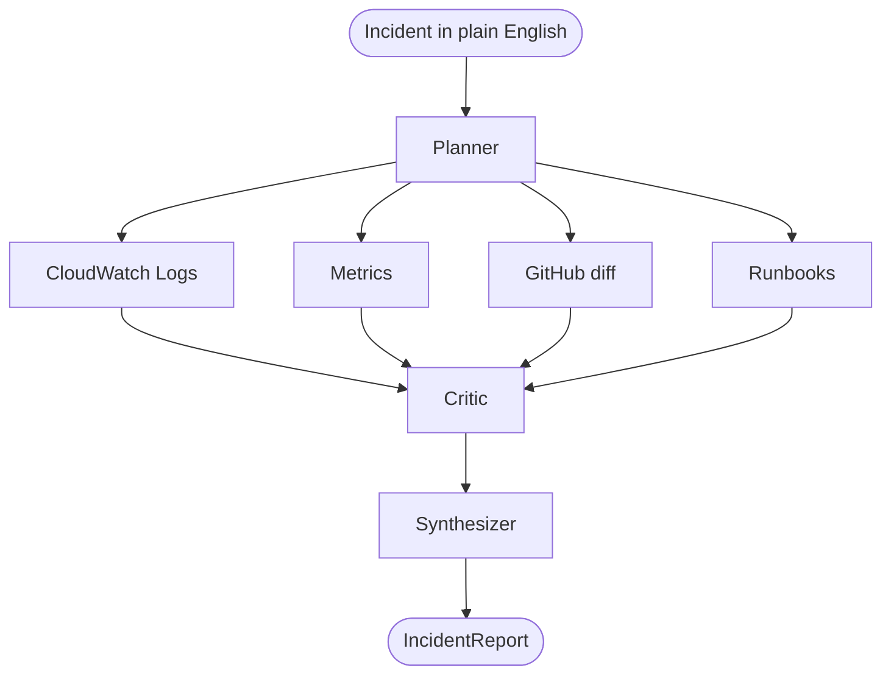

# Architecture

A [LangGraph](https://github.com/langchain-ai/langgraph) state graph runs a set of
specialist agents. You describe an incident in plain English; the graph
investigates your live AWS environment and returns a structured `IncidentReport`.

1. **Planner** reads the incident, extracts the service and time window, and picks
   which evidence sources to run.
2. The chosen specialists fan out **in parallel**, each adding `Evidence`:
   - **CloudWatch Logs** — scans the log group for error/5xx/timeout lines.
   - **Metrics** — pulls ECS CPU/memory and flags breaches.
   - **GitHub** — diffs the most recent deploy for risky changes (optional).
   - **Runbooks** — retrieves matching runbooks for the symptom.
3. **Critic** challenges the leading hypothesis and sets a calibrated confidence.
4. **Synthesizer** emits the final `IncidentReport` — root cause, evidence, a fix,
   and a confidence score. If the model can't return structured output, it falls
   back to a report built from the evidence, so a run always finishes.

An optional **Code Executor** can run a small sandboxed Python script between
gather and critic to quantify a hypothesis.

The copilot runs on a **single model** (default `claude-opus-4-8`), used by every
LLM node. AWS calls are **read-only**, and all configuration comes from the UI
settings store — never from environment variables (see [setup.md](./setup.md)).
