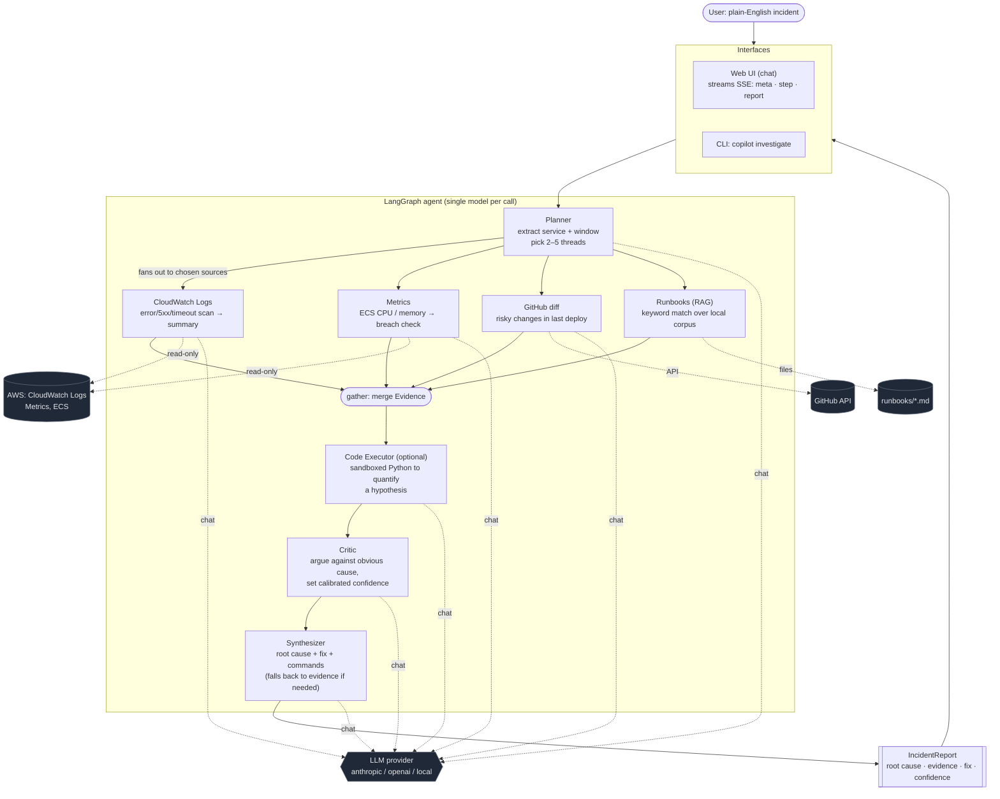
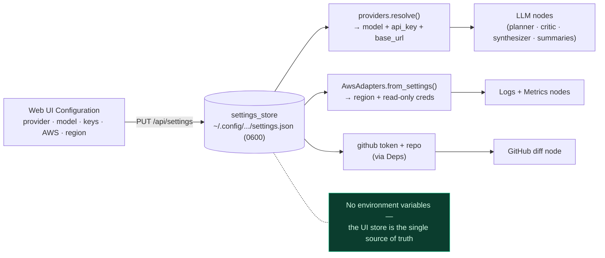

# Architecture

A [LangGraph](https://github.com/langchain-ai/langgraph) state graph orchestrates
a set of specialized agents. You describe an incident in plain English; the graph
investigates your live AWS environment and returns a structured `IncidentReport`.

## Pipeline

1. **Planner** decomposes the incident into investigation threads — it extracts
   the service name and a lookback window, and decides which evidence sources are
   worth querying.
2. Specialist nodes fan out **in parallel**, each appending `Evidence`:
   - **CloudWatch Logs** — scans the service's log group for error/5xx/timeout
     lines and summarizes the dominant signature.
   - **Metrics** — pulls ECS CPU/memory series and flags breaches.
   - **GitHub** — diffs the most recent deploy for risky changes (optional).
   - **Runbooks (RAG)** — retrieves matching runbooks for the symptom.
3. **Code Executor** (optional) writes and runs a small sandboxed Python script to
   quantify the leading hypothesis when the evidence can't state it directly.
4. **Critic** challenges the leading hypothesis and sets a calibrated confidence.
5. **Synthesizer** emits the final `IncidentReport` — root cause, supporting
   evidence, a concrete fix, a confidence score, and commands to run. If the model
   can't produce structured output, it falls back to a report built from the
   gathered evidence so a run always finishes.

The copilot runs on a **single model** (default `claude-opus-4-8`), used by every
LLM node. AWS calls are **read-only**.

## Investigation flow

## Configuration & credentials

Everything is configured in the UI and persisted to a single settings store —
nothing is read from the environment. `providers.resolve()`, the AWS session, and
the GitHub node all read from that store.

- The **planner** decides which sources run; only those branches execute, in
  parallel, each appending `Evidence`.
- After `gather`, the flow is sequential: **code executor → critic → synthesizer**.
- Every LLM node resolves to the single configured model; AWS calls are read-only.
- All config flows from the **UI → settings store**, never from env vars.
