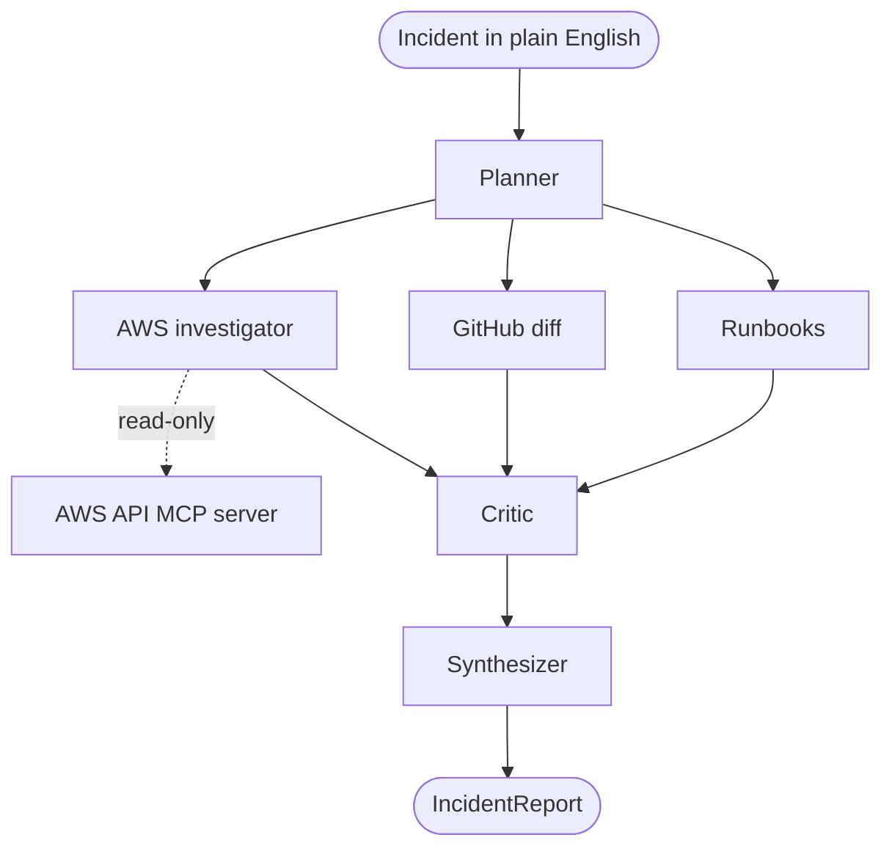

# Architecture

A [LangGraph](https://github.com/langchain-ai/langgraph) state graph runs a set of
specialist agents. You describe an incident in plain English; the graph
investigates your live AWS environment and returns a structured `IncidentReport`.

1. **Planner** reads the incident, extracts the service and time window, and picks
   which evidence sources to run.
2. The chosen specialists fan out **in parallel**, each adding `Evidence`:
   - **AWS investigator** — a tool-using agent that queries the live account
     through the [AWS API MCP server](https://github.com/awslabs/mcp/tree/main/src/aws-api-mcp-server)
     (`call_aws`). It decides which **read-only** AWS calls to make — CloudWatch
     logs/metrics, ECS, ELB, RDS, etc. — instead of being limited to a fixed set.
   - **GitHub** — diffs the most recent deploy for risky changes (optional).
   - **Runbooks** — retrieves matching runbooks for the symptom.
3. **Critic** challenges the leading hypothesis and sets a calibrated confidence.
4. **Synthesizer** emits the final `IncidentReport` — root cause, evidence, a fix,
   and a confidence score. If the model can't return structured output, it falls
   back to a report built from the evidence, so a run always finishes.

An optional **Code Executor** can run a small sandboxed Python script between
gather and critic to quantify a hypothesis.

The copilot runs on a **single model** (default `claude-opus-4-8`), used by every
LLM node. AWS access is **read-only** — the MCP server runs with
`READ_OPERATIONS_ONLY` and is bounded by your IAM permissions. All configuration
comes from the UI settings store — never from environment variables (see
[setup.md](./setup.md)).
